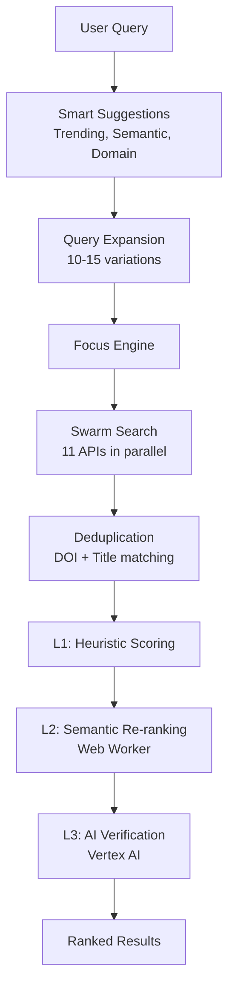

<!-- markdownlint-disable MD033 MD041 MD036 -->
<div align="center">


# ScholarLM

**AI-Powered Academic Research Assistant**

[](https://scholarlm-vbcr.web.app/)
[](https://react.dev/)
[](https://ai.google.dev/)
[](https://www.typescriptlang.org/)

[🚀 Live Demo](https://scholarlm-vbcr.web.app/) • [📖 Documentation](#features) • [🛠️ Development](#development)

</div>
<!-- markdownlint-enable MD033 MD041 -->

---

## 🎯 The Problem

Academic researchers waste **10+ hours per week** on literature discovery:

- 📑 **Scattered Sources** — Papers spread across Google Scholar, PubMed, arXiv, and databases
- 🔄 **Manual Synthesis** — Hours spent reading abstracts to find relevant work  
- 📊 **No Intelligence** — Traditional search gives results, not insights
- ⏳ **Repetitive Tasks** — Same queries, same filtering, same export workflows

> *"I spend more time finding papers than reading them."* — Every PhD student, ever.

---

## 💡 The Solution

ScholarLM is an **AI-powered research assistant** that transforms how researchers discover and analyze literature.

| Traditional Research           | With ScholarLM                    |
|--------------------------------|-----------------------------------|
| Search 5+ databases manually   | **One search, 200M+ papers**      |
| Read 50 abstracts              | **AI filters to top 20 relevant** |
| Write lit review (days)        | **Generate draft in minutes**     |
| Track trends manually          | **Visual trend analysis**         |
| Export citations one-by-one    | **Batch export (BibTeX, RIS)**    |

**Built for the AI era:** Powered by Google Gemini 3.0 via secure Vertex AI Cloud Functions.

---

## ✨ What's New (January 2026)

| Feature | Description |
|---------|-------------|
| 🤖 **WisDev Agent** | **Agentic Research Planner** that interviews you to build a precise search strategy |
| 🔄 **Hybrid RAG + CAG** | **Cache-Augmented Generation** for instant 100ms answers on repeat queries |
| 🔍 **Smart Search Suggestions** | Trending, Recent, Semantic, and Domain-aware autocomplete |
| 📊 **PRISMA Systematic Reviews** | Full 9-stage workflow with flow diagram export |
| 🧪 **Research Gap Detection** | AI identifies unexplored areas and generates hypotheses |
| ✍️ **Drafting Engine** | Long-form manuscript drafting with AI sections and guardrails |
| 🔐 **Secure API Architecture** | All AI calls routed through Vertex AI (no client-side keys) |

---

## 🔬 Features

### 🔍 Intelligent Search

- **11 Academic Sources** — Semantic Scholar, OpenAlex, PubMed, arXiv, CORE, Crossref, DBLP, BioRxiv, EuropePMC, PapersWithCode
- **Smart Suggestions** — Trending topics, semantic similarity, domain-aware autocomplete with paper counts
- **Aggressive Query Expansion** — 10-15 variations per query for comprehensive coverage
- **3-Layer Ranking** — Heuristic → Semantic Embeddings → AI Verification
- **Intent Detection** — Papers, Review, Trends, Definitions, Comparisons, Methodology
- **WisDev Agent** — A conversational planner that taxonomizes your research intent before searching to maximize precision.

### 🧠 AI-Powered Analysis

- **Paper Summaries** — TL;DR or detailed summaries at any level
- **Literature Reviews** — Auto-generate structured reviews
- **Research Gap Detection** — AI identifies unexplored areas with suggested hypotheses
- **Hypothesis Testing** — Evaluate research hypotheses against literature
- **Trend Analysis** — Visualize publication trends over time

### 📋 Systematic Review Suite (PRISMA)

- **9-Stage Workflow** — Protocol → Search → Deduplication → Screening → Data Extraction → Synthesis
- **Screening Interface** — Include/exclude with predefined reasons
- **PRISMA Flow Diagram** — Auto-generated visual export
- **Quality Assessment** — Built-in quality scoring

### ✍️ Writing Studio

- **AI/Plagiarism Detection** — Check content originality
- **Inline Text Tools** — Rephrase, elongate, simplify selected text
- **Grammar Checking** — LanguageTool integration
- **Document Upload** — PDF, Word, Markdown support

### 💾 Productivity

- **Paper Library** — Save, organize, and tag papers
- **Export Options** — BibTeX, RIS, JSON, Markdown, PDF
- **Research Timer** — Pomodoro-style focus sessions
- **Session Export** — Export complete research sessions

---

## 🏗️ Architecture



### Tech Stack

| Layer | Technology |
|-------|------------|
| **Frontend** | React 19 + TypeScript 5.8 |
| **Build** | Vite 6 |
| **AI** | Google Vertex AI (Gemini 3.0 Pro) |
| **Auth** | Firebase Authentication |
| **Database** | Firebase Firestore |
| **Functions** | Firebase Cloud Functions |
| **Cache** | 3-Layer (Memory → IndexedDB → Firestore) |
| **PWA** | Service Worker + Workbox |

---

## 🚀 Quick Start

```bash
# Clone the repository
git clone https://github.com/your-username/scholarlm.git
cd scholarlm

# Install dependencies
npm install

# Set environment variables
cp .env.example .env.local
# Edit .env.local with your API keys

# Run development server
npm run dev
```

### Available Scripts

| Command | Description |
|---------|-------------|
| `npm run dev` | Start development server |
| `npm run build` | Build for production |
| `npm run build:prod` | Production build with cloud mode |
| `npm run test` | Run test suite |
| `npm run preview` | Preview production build |
| `npm run ingest` | Ingest papers via pipeline |
| `npm run secrets:sync` | Sync GCP secrets to local env |
| `npm run icons:generate` | Generate PWA icons |

---

## 📁 Project Structure

```text
scholarlm/
├── components/          # 317+ React components
│   ├── SystematicReview/    # PRISMA workflow UI
│   ├── writing-studio/      # Writing tools
│   └── ...
├── services/            # 253+ TypeScript services
│   ├── focusEngine.ts       # Main search orchestrator
│   ├── smartQueryService.ts # Query expansion
│   ├── researchGapService.ts # Gap detection
│   └── ...
├── config/              # Centralized configuration
│   └── scoringConfig.ts     # Scoring weights & strategies
├── utils/               # Utility functions
│   └── paperUtils.ts        # Deduplication utilities
├── workers/             # Web Workers
│   └── embeddingWorker.ts   # Off-thread embeddings
├── functions/           # Firebase Cloud Functions
└── api/                 # Vercel API routes
```

---

## 💰 Pricing

| Tier | Price | Features |
|------|-------|----------|
| **Free** | $0/mo | Fast mode, 50 searches/day, 10 summaries |
| **Pro** | $9/mo | All modes, unlimited searches, PRISMA workflows |
| **Enterprise** | $29/mo | Team features, API access, priority support |

> **Note:** Currently in **Beta** with all features unlocked.

---

## 📚 Documentation

| Category | Links |
|----------|-------|
| **User Guide** | [📘 Guide](./docs/user/USER_GUIDE.md) • [❓ FAQ](./docs/user/FAQ.md) • [⌨️ Shortcuts](./docs/user/KEYBOARD_SHORTCUTS.md) |
| **Developer** | [📐 Architecture](./docs/dev/architecture/ARCHITECTURE.md) • [🔌 API Reference](./docs/dev/architecture/API_REFERENCE.md) • [🔍 Search Architecture](./docs/dev/architecture/SEARCH_SUBSYSTEM_ARCHITECTURE.md) |
| **Operations** | [🚀 Ops Manual](./docs/ops/OPERATIONS_MANUAL.md) • [📈 Monitoring](./docs/ops/OPERATIONS_MANUAL.md#chapter-4-monitoring--observability) |
| **Business** | [🛣️ Roadmap](./docs/business/product/ROADMAP.md) • [📊 Features](./docs/business/product/FEATURES.md) |

---

## 🔒 Security

- All AI API calls routed through secure backend (Vertex AI)
- No client-side API keys in production builds
- Firebase Security Rules for data access
- HTTPS enforced on all endpoints

---

<!-- markdownlint-disable MD033 -->
<div align="center">
<sub>Built with ❤️ for researchers everywhere</sub>

<br/><br/>

**[⭐ Star this repo](https://github.com/your-username/scholarlm)** if you find it useful!

</div>
<!-- markdownlint-enable MD033 -->
