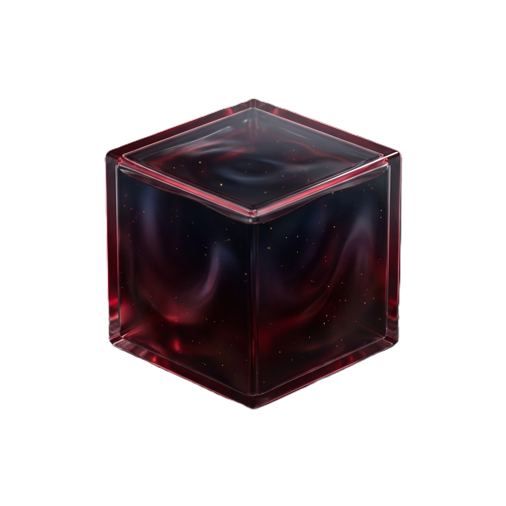

<!-- Header -->
<div align="center">

[](https://github.com/bharathvbcr)

<!-- Typing Animation -->
<a href="https://git.io/typing-svg"></a>

<!-- Visitor Counter -->
<br><br>


<!-- Social Badges -->
<br><br>
[](https://www.linkedin.com/in/bharath-vbcr/)
&nbsp;&nbsp;
[](https://bharath-vbcr.web.app/)
&nbsp;&nbsp;
[](https://scholar.google.com/citations?user=7sP8mBIAAAAJ&hl=en)

</div>

---

### 🚀 About Me

```typescript
const bharath = {
    role: "Vibe Coder | AI Native Developer",
    founder: "ScholarLM",
    philosophy: "Code fast, break barriers, stay in flow",
    currentFocus: ["Agentic Workflows", "RAG Systems", "AI-First Development"],
    funFact: "I ship complex tools at the speed of thought using LLMs"
};
```

<table><tr><td valign="top" width="60%">
<ul>
<li>🔭 <b>Founder</b>: <a href="https://scholarlm-vbcr.web.app/"><b>ScholarLM</b></a> — AI-powered academic research assistant (<a href="https://scholarlm-vbcr.web.app/about">About</a>)</li>
<li>🛠️ <b>Open Source</b>: <a href="https://github.com/bharathvbcr/LiquiTask"><b>LiquiTask</b></a> & <a href="https://github.com/bharathvbcr/AcademiaTrack"><b>AcademiaTrack</b></a></li>
<li>🌱 <b>Exploring</b>: Agentic Workflows, RAG, and AI-First Development</li>
<li>📝 <b>Published</b>: 2 peer-reviewed papers in 2025</li>
<li>💬 <b>Ask me about</b>: Utilizing AI to 10x development speed</li>
</ul>
</td><td valign="top" width="40%">

</td></tr></table>

---

### 📚 Publications

<div align="center">

| 📄 Paper | 📰 Journal | 🗓️ Year |
|:---------|:-----------|:-------:|
| [**Orofacial Region-Derived Mesenchymal Stem Cells**](https://doi.org/10.3390/bioengineering12010050) | *Bioengineering* | 2025 |
| [**Functionalized Magnetic Hydrogels in Cancer Hyperthermia**](https://doi.org/10.1088/2057-1976/adb2f9) | *Biomedical Physics & Engineering Express* | 2025 |

</div>

---

### ⚡ Tech Stack

<div align="center">


</div>

---

### 🌟 Featured Projects

<div align="center">

#### 🎯 Flagship Project

<a href="https://scholarlm-vbcr.web.app/">
  
</a>

**[ScholarLM](https://scholarlm-vbcr.web.app/)** — AI-powered academic research assistant

**11 sources • 200M+ papers • 3-layer ranking • WisDev agent • RAG/CAG hybrid • PRISMA workflows**

`Gemini 2.0` `Vertex AI` `React 19` `TypeScript`

[](https://scholarlm-vbcr.web.app/) [](https://scholarlm-vbcr.web.app/about)

---

#### 🛠️ Open Source

| | Project | Description | Tech |
|:--|:--------|:------------|:-----|
|  | **[LiquiTask](https://github.com/bharathvbcr/LiquiTask)** | Liquid Glass UI, native persistence, Cmd+K palette. QuickAdd syntax, WIP limits, executive dashboard. | `Electron 33` `React 19` `Vite` |
|  | **[AcademiaTrack](https://github.com/bharathvbcr/AcademiaTrack)** | 4 views (List/Kanban/Calendar/Timeline), analytics dashboard, deadline badges, faculty & budget tracking. | `React` `Firebase` |

</div>

---

### 📊 GitHub Stats

<div align="center">
  
</div>

<!-- Activity Graph -->
<div align="center">
  
</div>

<!-- Contribution Snake -->
<div align="center">
  
</div>

---

<div align="center">
  
</div>
