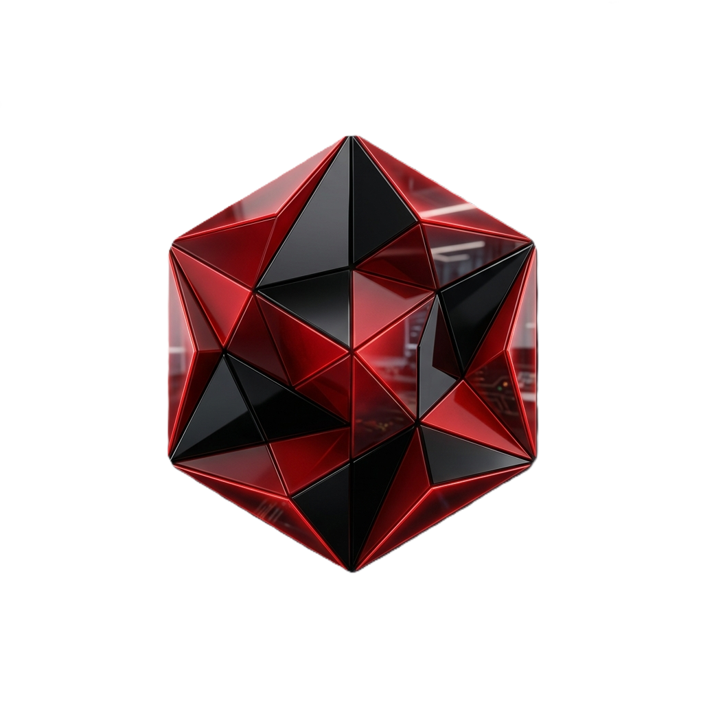
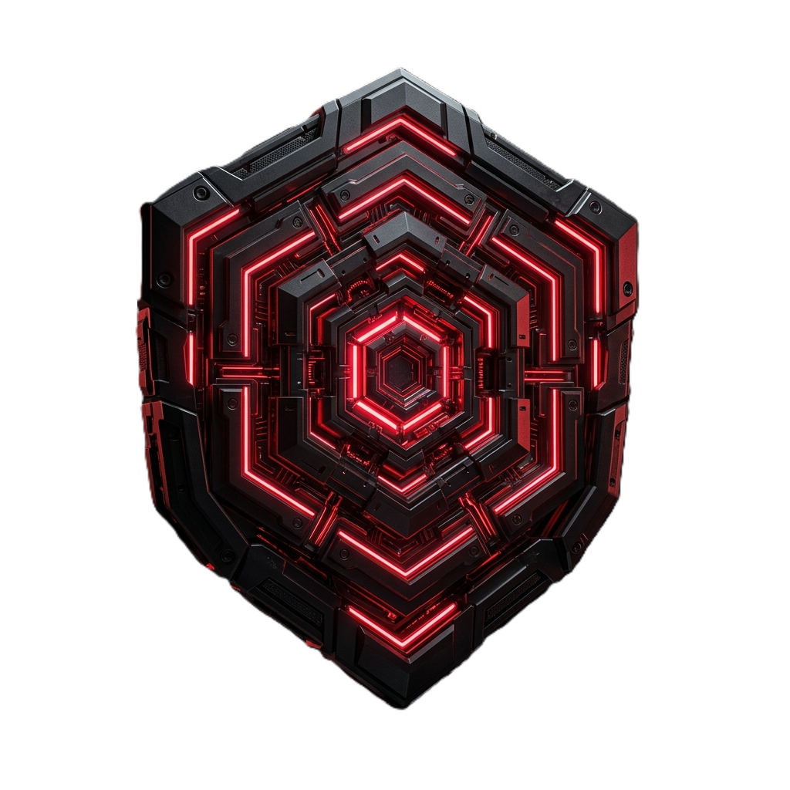
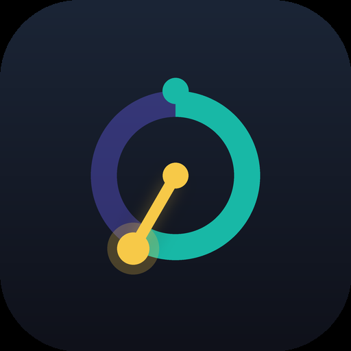
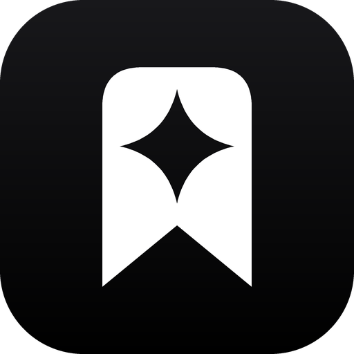
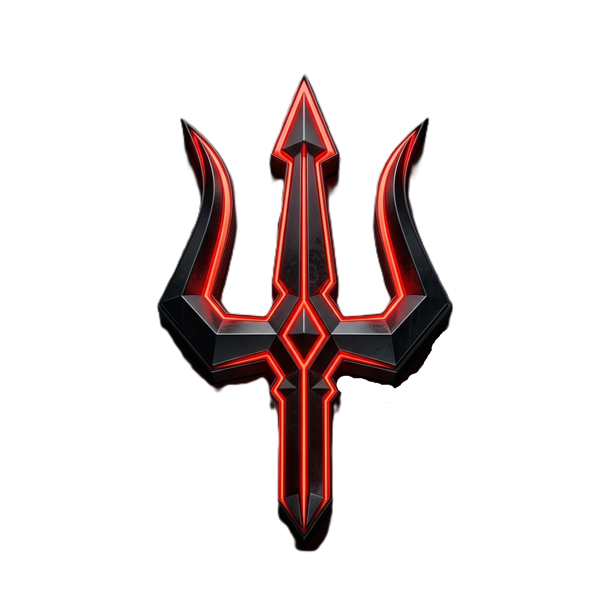
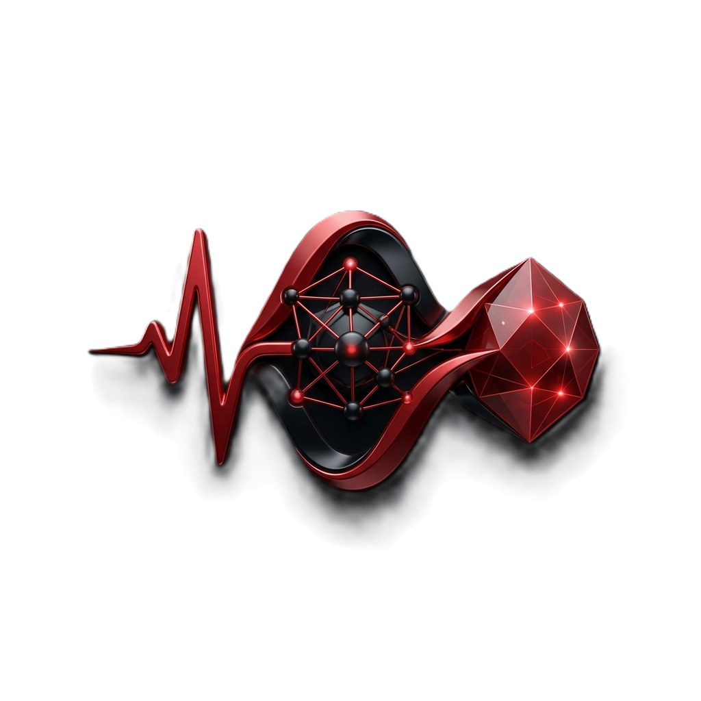
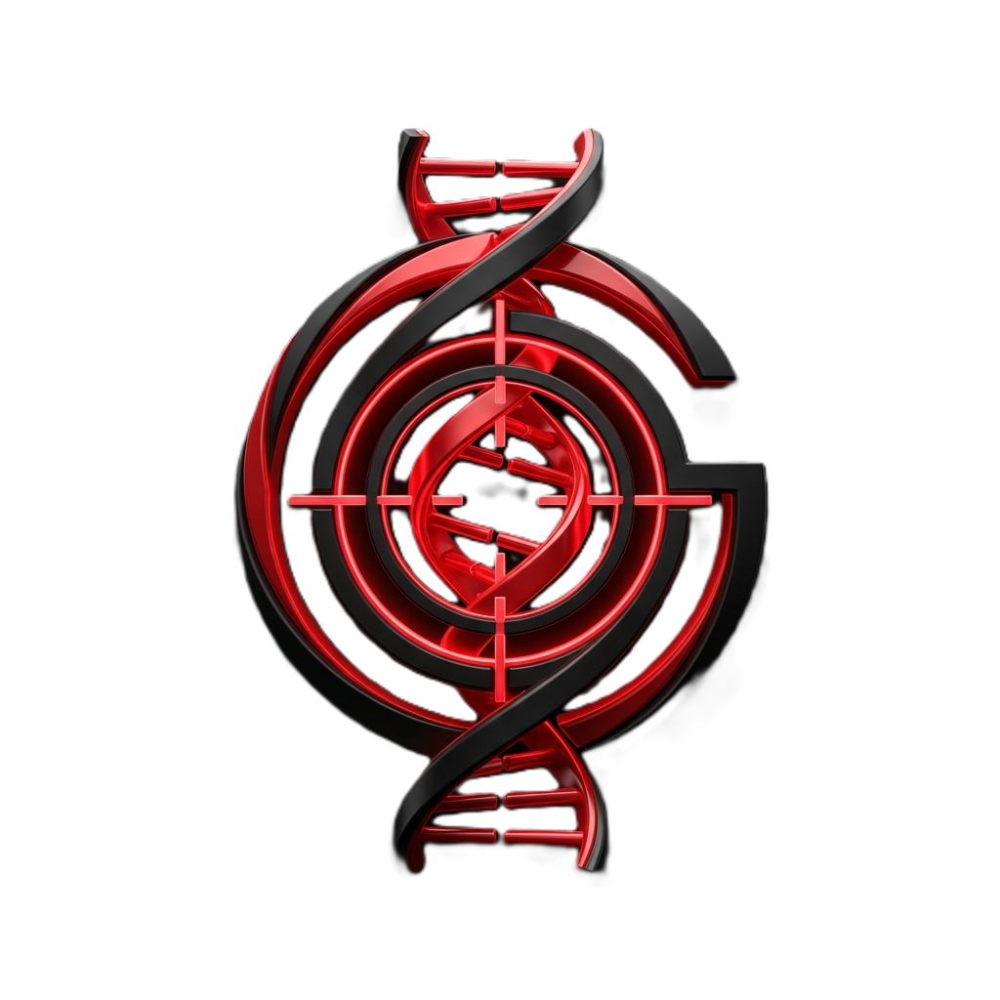

<!-- Hero -->

  
   
   
  <h1>Bharath Chandra</h1>
  
<strong>Founder at ScholarLM</strong>

  
Building AI-native research software, ranking systems, and developer workflows that feel sharp, credible, and genuinely useful.

   
  &nbsp;&nbsp;
    
  
    
  &nbsp;&nbsp;&nbsp;

---

<table align="center">
<tr>
<td align="center" width="33%">
  <strong>Founder</strong> 
  ScholarLM
</td>
<td align="center" width="33%">
  <strong>Research</strong> 
  2 peer-reviewed papers
</td>
<td align="center" width="33%">
  <strong>Build Range</strong> 
  Web, desktop, mobile, ML &amp; retrieval
</td>
</tr>
</table>

---

## About

- I build products where AI improves real workflows instead of adding friction.
- Founder of [ScholarLM](https://scholarlm-vbcr.web.app/), an academic research assistant focused on retrieval quality, explainability, and practical UX.
- My work spans product strategy, frontend systems, retrieval and ranking logic, and AI-assisted developer workflows.
- I optimize for execution quality, strong product judgment, and systems that feel credible to both users and technical teams.

  &nbsp;&nbsp;&nbsp;

 

<table align="center">
<tr>
<td align="left" width="50%">
  <strong>🎯 Product + UX</strong>  
  • Workflow-first product thinking 
  • Clear interfaces with strong interaction quality 
  • Fast feedback loops tied to real use cases
</td>
<td align="left" width="50%">
  <strong>🤖 AI + Retrieval</strong>  
  • Ranking heuristics and explainability-first design 
  • Production retrieval pipelines with measurable quality 
  • Practical AI systems over novelty for its own sake
</td>
</tr>
<tr>
<td align="left" width="50%">
  <strong>📄 Research + Credibility</strong>  
  • Academic domain fluency and peer-review standards 
  • Familiarity with PRISMA, systematic review workflows 
  • Focus on trust, signal quality, and defensible outputs
</td>
<td align="left" width="50%">
  <strong>⚡ Execution + Range</strong>  
  • Product strategy through implementation 
  • Frontend systems, ranking logic, and AI workflows 
  • Ambiguous ideas translated into usable products
</td>
</tr>
</table>

---

<table align="center">
<tr>
<td align="left" width="50%">
  <strong>🏆 Selected Signals</strong>  
  • Built and shipped <a href="https://scholarlm-vbcr.web.app/">ScholarLM</a> end-to-end — retrieval, ranking, UX, and deployment. 
  • 2 peer-reviewed publications in biomedical physics and bioengineering (2025). 
  • 14 projects across AI orchestration, desktop &amp; Android apps, creative web, and ML research — in TypeScript, Python, Kotlin, Go, and Rust.
</td>
<td align="left" width="50%">
  <strong>🔭 Current Focus</strong>  
  • Multilingual research workflows and better discoverability in ScholarLM. 
  • On-device AI on mobile — review-gated planning with Gemini Nano (ChronosFlow). 
  • Gated, verifiable AI-assisted developer workflows (DevCouncil, DevPrism). 
  • Parameter-efficient LLM training and computational therapy pipelines.
</td>
</tr>
</table>

---

### 📚 Publications

| Paper | Journal | Year |
| --- | --- | --- |
| [Investigation on the heating effects of intra-tumoral injectable magnetic hydrogels (IT-MG) for cancer hyperthermia](https://iopscience.iop.org/article/10.1088/2057-1976/adaec6/meta) | _Biomedical Physics & Engineering Express_ | 2025 |
| [The Therapeutic Scope of Orofacial Mesenchymal Stem Cells](https://www.mdpi.com/2306-5354/12/9/970) | _Bioengineering_ | 2025 |

---

### Stack

**Languages** &nbsp;      

**Web & App** &nbsp;       

**AI / Infra** &nbsp;      

---

### Engineering Profile

- Product engineering: interface design, frontend architecture, and shipping polished user flows.
- AI systems: retrieval pipelines, ranking heuristics, explainability, and workflow-oriented UX.
- Deep learning: physiological signal processing, bio-signal analysis, and computational biology pipelines.
- Execution style: fast iteration, clear tradeoffs, and practical scope control. Best fit for AI product work, early-stage teams, and frontend-heavy builds.

---

### Selected Work

#### ScholarLM

  

**[ScholarLM](https://scholarlm-vbcr.web.app/)**  
AI-powered academic assistant with hybrid retrieval, ranking layers, PRISMA workflows, and research-focused UX.

 

  &nbsp;&nbsp;&nbsp;

#### Open Source

<table>
<tr>
<th align="center" width="72">Icon</th>
<th align="left">Project</th>
<th align="left">Stack</th>
</tr>
<tr>
<td align="center" width="72">
  
</td>
<td>
  <b><a href="https://github.com/bharathvbcr/DevPrism">DevPrism</a></b> 
  Local-first desktop workspace for LaTeX writing and AI-assisted research — offline compilation, Git-backed history, ~150 installable scientific skills, and swappable local/hosted AI with diff-reviewed edits.
</td>
<td>
  &nbsp;&nbsp;
</td>
</tr>
<tr>
<td align="center" width="72">
  
</td>
<td>
  <b><a href="https://github.com/bharathvbcr/DevCouncil">DevCouncil</a></b> 
  Gated orchestrator for AI-assisted software development enforcing strict staff-engineer-style execution gates.
</td>
<td>
  
</td>
</tr>
<tr>
<td align="center" width="72">
  
</td>
<td>
  <b><a href="https://github.com/bharathvbcr/ChronosFlow">ChronosFlow</a></b> 
  Dial-first Android day planner rendering the whole day as a 24-hour radial dial — time blocks, habits, meds, and focus sessions with review-gated on-device Gemini Nano planning and a Wear OS companion.
</td>
<td>
  &nbsp;&nbsp;
</td>
</tr>
<tr>
<td align="center" width="72">
  
</td>
<td>
  <b><a href="https://github.com/bharathvbcr/Meridian">Meridian</a></b> 
  Time &amp; world planner — a day/night terminator map and 3D globe, a fairness-ranked multi-zone meeting scheduler with .ics export, and an on-device Gemini Nano scheduling assistant, plus home-screen surfaces and a Wear OS tile.
</td>
<td>
  &nbsp;&nbsp;
</td>
</tr>
<tr>
<td align="center" width="72">
  
</td>
<td>
  <b><a href="https://github.com/bharathvbcr/Curio">Curio</a></b> 
  On-device AI bookmark assistant — ML Kit OCR makes screenshots searchable, a dual-mode engine auto-categorizes and summarizes saved links via xAI Grok, and you can chat with your library, behind a liquid-glass Material You UI.
</td>
<td>
  &nbsp;&nbsp;
</td>
</tr>
<tr>
<td align="center" width="72">
  
</td>
<td>
  <b><a href="https://github.com/bharathvbcr/WisDev">WisDev</a></b> 
  Terminal-first, open-source AI research agent. Plans, executes, and synthesizes deep research tasks across academic sources.
</td>
<td>
  
</td>
</tr>
<tr>
<td align="center" width="72">
  
</td>
<td>
  <b><a href="https://github.com/bharathvbcr/LiquiTask">LiquiTask</a></b> 
  Desktop task manager with a liquid-glass UI, native persistence, quick-command palette, and executive dashboard workflows.
</td>
<td>
  &nbsp;&nbsp;
</td>
</tr>
<tr>
<td align="center" width="72">
  
</td>
<td>
  <b><a href="https://github.com/bharathvbcr/AcademiaTrack">AcademiaTrack</a></b> 
  Academic workflow manager with list, kanban, calendar, and timeline views plus deadline, faculty, and budget tracking.
</td>
<td>
  &nbsp;
</td>
</tr>
<tr>
<td align="center" width="72">
  💍
</td>
<td>
  <b><a href="https://github.com/bharathvbcr/Whimsical-Love">Whimsical-Love</a></b> 
  Animated proposal website with cinematic scroll, interactive story book, 3D ring reveal, and love quiz.
</td>
<td>
  &nbsp;&nbsp;
</td>
</tr>
<tr>
<td align="center" width="72">
  🌑
</td>
<td>
  <b><a href="https://github.com/bharathvbcr/Void">Void</a></b> 
  Immersive, mobile-optimized digital monument with custom haptics engine, mood system, and silence counter.
</td>
<td>
  &nbsp;&nbsp;
</td>
</tr>
<tr>
<td align="center" width="72">
  
</td>
<td>
  <b><a href="https://github.com/bharathvbcr/Stress_Project">Stress_Project</a></b> 
  Deep learning pipeline for wearable stress detection using CNN-LSTM, Transformer, and attention architectures on WESAD/NURSE data.
</td>
<td>
  &nbsp;&nbsp;
</td>
</tr>
<tr>
<td align="center" width="72">
  
</td>
<td>
  <b><a href="https://github.com/bharathvbcr/GenoThermal_Targeting">GenoThermal_Targeting</a></b> 
  End-to-end computational pipeline for patient-specific magnetic nanoparticle therapy — genomic discovery through physics simulation.
</td>
<td>
  &nbsp;&nbsp;
</td>
</tr>
<tr>
<td align="center" width="72">
  ⛳
</td>
<td>
  <b>Parameter Golf</b> 
  LLM parameter-efficiency experiments for the OpenAI Model Craft Challenge — pure-PyTorch Mamba-2 and Gated DeltaNet reimplementations, a staged ablation pipeline, and a 16 MB submission trainer, all runnable on an 8 GB consumer GPU.
</td>
<td>
  &nbsp;
</td>
</tr>
<tr>
<td align="center" width="72">
  🫐
</td>
<td>
  <b>Passive-First Blueberry Greenhouse</b> 
  Zero-build engineering documentation suite for a passive-cooled blueberry greenhouse in Tirupati, India — interactive Three.js 3D visualizer with animated airflow modes, 14 diagram sheets, and DXF CAD handoff.
</td>
<td>
  &nbsp;
</td>
</tr>
</table>

---

### GitHub Activity

  &nbsp;

  <table>
    <tr>
      <td width="50%">
        
      </td>
      <td width="50%" align="left" valign="top">
        <strong>🔬 Current Technical Focus</strong>  
        • Cross-lingual retrieval and citation graph ranking 
        • On-device LLMs (Gemini Nano) and parameter-efficient training 
        • Multi-module Android, Tauri/Rust, and Electron app architecture 
        • Verifiable, gated AI-assisted developer workflows
      </td>
    </tr>
  </table>

  

  

---

  

