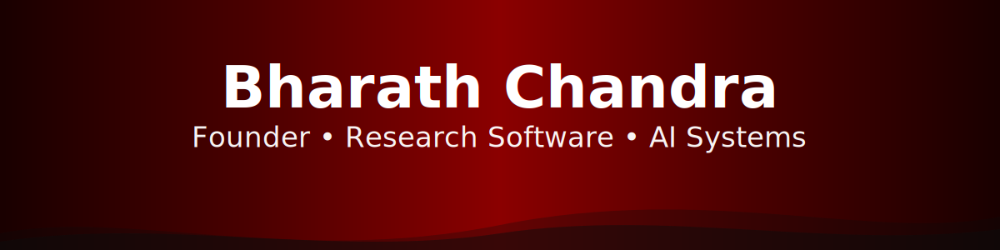
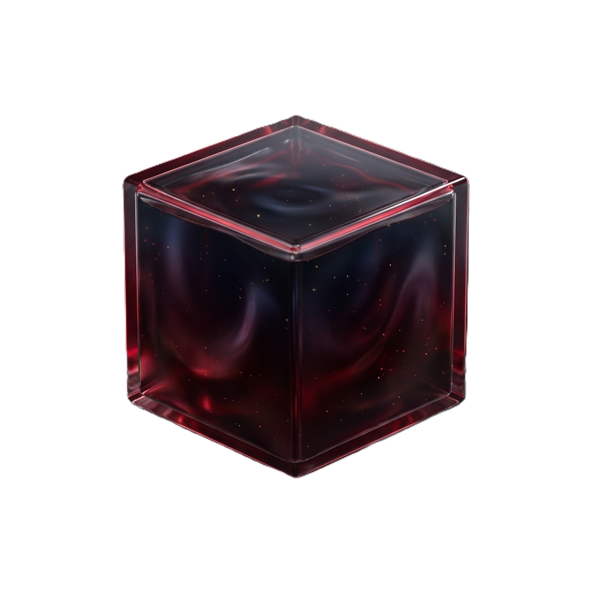

<!-- Hero -->

  
   
   
  <h1>Bharath Chandra</h1>
  
<strong>Founder at ScholarLM</strong>

  
Building AI-native research software, ranking systems, and developer workflows that feel sharp, credible, and genuinely useful.

  
  
  
   
  
   
   
  
  
  
  

---

<table align="center">
<tr>
<td align="center" width="33%">
  <strong>Founder</strong> 
  ScholarLM
</td>
<td align="center" width="33%">
  <strong>Research</strong> 
  2 peer-reviewed papers
</td>
<td align="center" width="33%">
  <strong>Build Range</strong> 
  Product, frontend, retrieval, ranking
</td>
</tr>
</table>

---

## About

- I build products where AI improves real workflows instead of adding friction.
- Founder of [ScholarLM](https://scholarlm-vbcr.web.app/), an academic research assistant focused on retrieval quality, explainability, and practical UX.
- My work spans product strategy, frontend systems, retrieval and ranking logic, and AI-assisted developer workflows.
- I optimize for execution quality, strong product judgment, and systems that feel credible to both users and technical teams.

  
  
  
  

 

<table align="center">
<tr>
<td align="center" width="50%">
  <strong>Product + UX</strong>  
  Workflow-first product thinking 
  Clear interfaces with strong interaction quality 
  Fast feedback loops tied to real use cases
</td>
<td align="center" width="50%">
  <strong>AI + Retrieval</strong>  
  Retrieval quality and ranking behavior 
  Explainability built into product experience 
  Practical AI systems over novelty for its own sake
</td>
</tr>
<tr>
<td align="center" width="50%">
  <strong>Research + Credibility</strong>  
  2 peer-reviewed papers published in 2025 
  Familiarity with academic workflows and expectations 
  Focus on trust, signal quality, and defensible outputs
</td>
<td align="center" width="50%">
  <strong>Execution + Range</strong>  
  Product strategy through implementation 
  Frontend systems, ranking logic, and AI workflows 
  Ambiguous ideas translated into usable products
</td>
</tr>
</table>

---

<table align="center">
<tr>
<td align="left" width="50%">
  <strong>Selected Signals</strong>  
  Built and launched <a href="https://scholarlm-vbcr.web.app/">ScholarLM</a> around ranking quality, explainability, and real academic workflows. 
  Published 2 peer-reviewed papers across biomedical and bioengineering domains. 
  Work across product strategy, frontend systems, retrieval logic, and AI-assisted development workflows.
</td>
<td align="left" width="50%">
  <strong>Current Focus</strong>  
  Product-grade AI research tooling with robust UX and explainable outputs. 
  Multilingual researcher workflows and better discoverability in ScholarLM. 
  Open-source products that stay polished, documented, and easy to fork.
</td>
</tr>
</table>

---

### 📚 Publications

| Paper | Journal | Year |
| --- | --- | --- |
| [Investigation on the heating effects of intra-tumoral injectable magnetic hydrogels (IT-MG) for cancer hyperthermia](https://iopscience.iop.org/article/10.1088/2057-1976/adaec6/meta) | _Biomedical Physics & Engineering Express_ | 2025 |
| [The Therapeutic Scope of Orofacial Mesenchymal Stem Cells](https://www.mdpi.com/2306-5354/12/9/970) | _Bioengineering_ | 2025 |

---

### Stack

**Languages**

**Web & App**

**AI / Infra**

---

### Engineering Profile

- Product engineering: interface design, frontend architecture, and shipping polished user flows.
- AI systems: retrieval pipelines, ranking heuristics, explainability, and workflow-oriented UX.
- Execution style: fast iteration, clear tradeoffs, and practical scope control instead of overengineering.

---

### Selected Work

#### ScholarLM

  

**[ScholarLM](https://scholarlm-vbcr.web.app/)**  
AI-powered academic assistant with hybrid retrieval, ranking layers, PRISMA workflows, and research-focused UX.

 

  
  
  
  

#### Open Source

<table>
<tr>
<td align="center" width="72">
  
</td>
<td>
  <b><a href="https://github.com/bharathvbcr/LiquiTask">LiquiTask</a></b> 
  Desktop task manager with a liquid-glass UI, native persistence, quick-command palette, and executive dashboard workflows.
</td>
<td>
  
  
  
</td>
</tr>
<tr>
<td align="center" width="72">
  
</td>
<td>
  <b><a href="https://github.com/bharathvbcr/AcademiaTrack">AcademiaTrack</a></b> 
  Academic workflow manager with list, kanban, calendar, and timeline views plus deadline, faculty, and budget tracking.
</td>
<td>
  
  
</td>
</tr>
</table>

---

### Working Style

- Best fit: AI product work, early-stage product teams, research workflows, ranking and retrieval quality, and frontend-heavy product builds.
- I care about useful interfaces, defensible technical decisions, and products that are genuinely used.

---

### GitHub Activity

  
  

  <table>
    <tr>
      <td width="50%">
        
      </td>
      <td width="50%" align="left" valign="top">
        <strong>Current Technical Focus</strong>  
        Retrieval quality and ranking behavior 
        Research-first UX and explainability 
        Frontend systems with polished interactions 
        AI-native workflows that reduce execution drag 
        Fast product iteration without losing rigor
      </td>
    </tr>
  </table>

  

  

---

  

