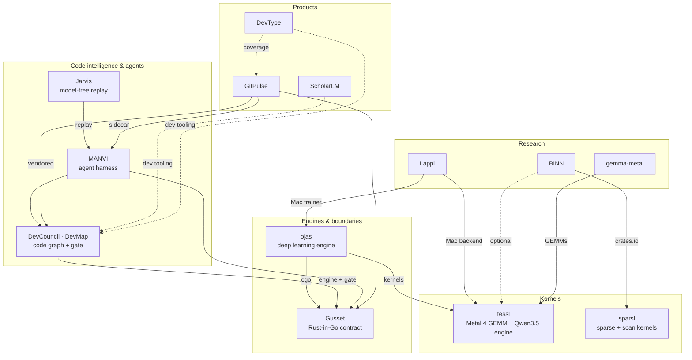
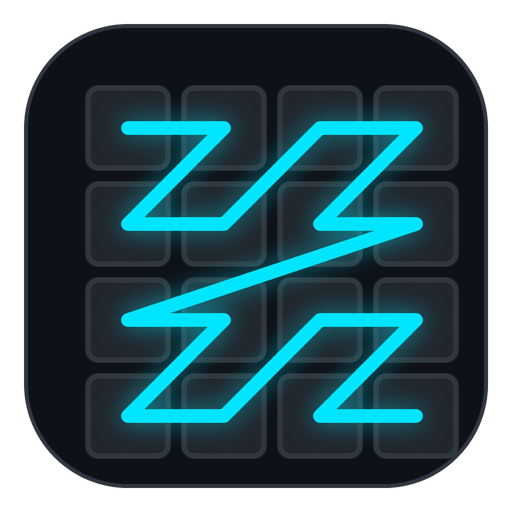
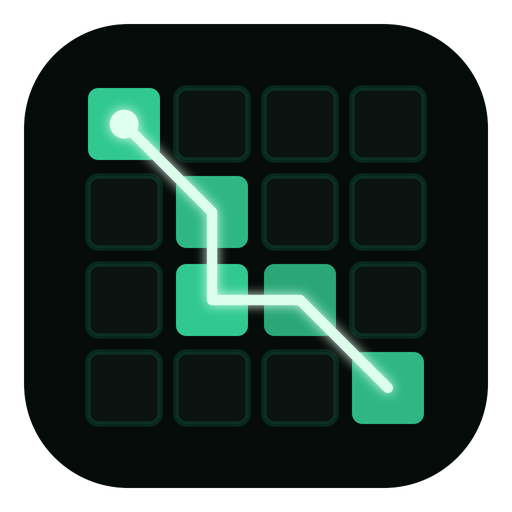
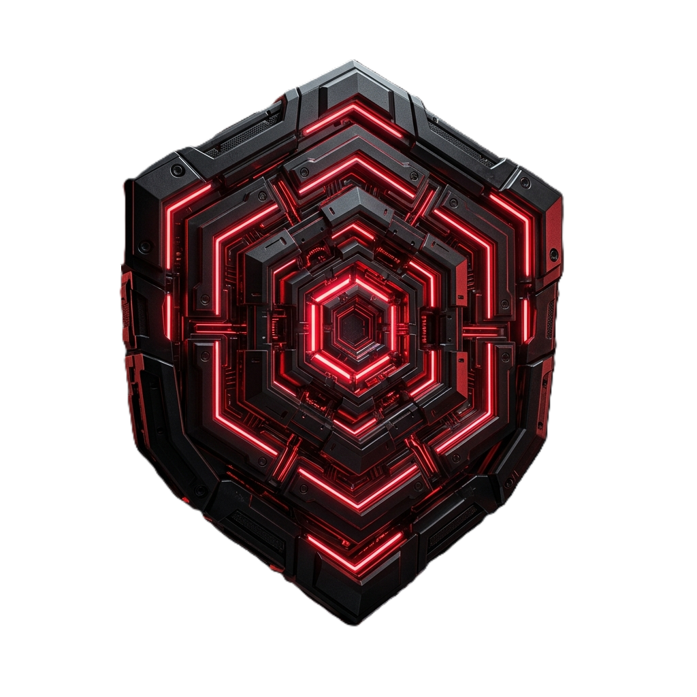
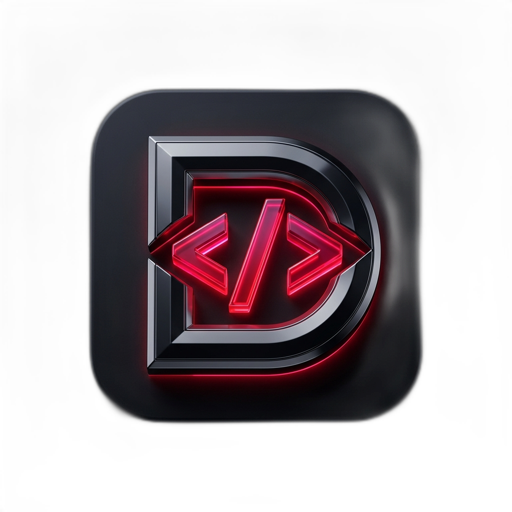

<!-- Hero -->

  
   
   
  
<strong>ML systems engineer · Founder at <a href="https://scholarlm.dev/">ScholarLM</a></strong>

  
I make ML and developer infrastructure fast, and I prove it with numbers: Metal GPU kernels, Rust and Go runtimes, and code-intelligence tools for AI agents, built as modules that every new project reuses.

  
<b>Open to opportunities</b> · <a href="mailto:bharath@vbcr.dev">bharath@vbcr.dev</a> · Dallas–Fort Worth, TX

   
  &nbsp;&nbsp;
    
  
    
  &nbsp;&nbsp;&nbsp;

---

## At a glance

- **Now:** founder and sole engineer of [ScholarLM](https://scholarlm.dev/), an AI research platform (React, Rust, Go and Python) that writes fully-cited manuscripts. In parallel I build the performance stack below.
- **Strongest results:** a Qwen3.5-2B engine that runs **2.1–2.2× faster than PyTorch** on Apple GPUs, a code-graph indexer that builds its index 1.6–21× faster than five other tools on every corpus tested, and a Go↔Rust call path made **24× cheaper**.
- **Before:** Associate Researcher at the Adidas Center for Engagement Science (ASU, 2023–2025), and stem-cell research at Texas Tech University Health Sciences Center.
- **Education & papers:** M.S. Biomedical Engineering, Arizona State University (2024) · 2 peer-reviewed papers (2025).

---

## Measured

Each figure comes from the project's own benchmark record, with its conditions. Where a figure didn't survive a re-check, it isn't here.

| Project | Result | Conditions |
| --- | --- | --- |
| **[tessl](https://tessl.vbcr.dev/)** | **2.14× / 2.12× / 2.22× faster than PyTorch MPS** at 200 / 2,048 / 8,192 tokens | Identical Qwen3.5-2B work (real-weight prefill, prefix state kept, 17 answer rows scored), one GPU hold, lengths interleaved, M5 Pro, 2026-10-04. PyTorch's gated-delta layer runs its pure-torch fallback, the only path on a Mac. Separately, bf16 GEMM is 2.55× MLX. |
| **[DevMap](https://devcouncil.vbcr.dev/)** | **1.6–21× faster cold index** and **2.2–107× faster refresh** than five other code-graph tools, on all four corpora · 9.7 ms definition lookups | v0.2.2, M5 Pro, every corpus pinned to a commit (2026-09-14). Lost single-file re-index to CodeGraph. |
| **[Gusset](https://gusset.vbcr.dev/)** | Go→Rust serial call **90.3 → 3.73 µs (24×)** | Spin-then-park plus a shared-memory completion ring, linux-amd64 VM. Backed by a chaos hammer, fuzz targets and Miri. |
| **[ojas](https://ojas.vbcr.dev/)** | Training-block step **41.5 ms vs PyTorch's 43.1 ms** on CPU | Apple M5 Pro CPU, forward + backward, 124 of 127 outputs within tolerance (2026-10-02). Some single ops are still slower. |
| **[GitPulse](https://gitpulse.vbcr.dev/)** | **−48%** median process spawn-and-wait (3.64 → 1.89 ms) | One controlled run, 200 samples. |
| **[BINN](https://binn.vbcr.dev/)** | **0.8320** on Spiking Heidelberg Digits, 12/12 seeds ≥ 0.80 | Both pre-registered crux gates for backprop-free learning **failed**, and are reported alongside it. |
| **[Sequence mixers](https://attention.vbcr.dev/)** | **~6.9×** Mamba-2 throughput from a chunk-parallel SSD scan | nanolab, seed-paired intervals. |

---

## The stack

Each project is a module the next one is built on. Every arrow below is a real dependency in the source: a crate, a `go.mod` require, a vendored engine or a spawned sidecar. Arrows point from a project to what it builds on.

```mermaid
flowchart TB
  subgraph K["Kernels"]
    tessl["tessl<br/>Metal 4 GEMM + Qwen3.5 engine"]
    sparsl["sparsl<br/>sparse + scan kernels"]
  end
  subgraph E["Engines & boundaries"]
    ojas["ojas<br/>deep learning engine"]
    gusset["Gusset<br/>Rust-in-Go contract"]
  end
  subgraph A["Code intelligence & agents"]
    devmap["DevCouncil · DevMap<br/>code graph + gate"]
    manvi["MANVI<br/>agent harness"]
    jarvis["Jarvis<br/>model-free replay"]
  end
  subgraph P["Products"]
    gitpulse["GitPulse"]
    scholarlm["ScholarLM"]
    devtype["DevType"]
  end
  subgraph R["Research"]
    binn["BINN"]
    lappi["Lappi"]
    gemma["gemma-metal"]
  end

  ojas -->|kernels| tessl
  ojas -->|cgo| gusset
  lappi -->|Mac backend| tessl
  lappi -->|Mac trainer| ojas
  binn -->|crates.io| sparsl
  binn -.->|optional| tessl
  gemma -->|GEMMs| tessl
  devmap -->|engine + gate| gusset
  manvi --> devmap
  manvi --> gusset
  jarvis -->|replay| manvi
  gitpulse -->|vendored| devmap
  gitpulse -->|sidecar| manvi
  gitpulse --> gusset
  scholarlm -.->|dev tooling| devmap
  devtype -.->|dev tooling| devmap
  devtype -.->|coverage| gitpulse
```

`sparsl` was lifted out of BINN's numeric core and published on its own. GitPulse also vendors MarkDev's renderer crates, and DevPrism embeds MANVI as its tool gate. Explore the same graph interactively on **[bharath.vbcr.dev](https://bharath.vbcr.dev/#ecosystem)**.

---

## Core projects

<table>
<tr><th align="center" width="72"></th><th align="left">Project</th><th align="left">Builds on · Used by</th></tr>

<tr><td colspan="3"><b>Kernels</b></td></tr>
<tr>
<td align="center"></td>
<td><b><a href="https://github.com/bharathvbcr/tessl">tessl</a></b> · <a href="https://tessl.vbcr.dev/">tessl.vbcr.dev</a> Makes the matrix math inside LLMs fast on Apple GPUs. A Metal 4 GEMM and tensor runtime in Rust: MPP TensorOps <code>matmul2d</code>, cooperative register accumulators, fused epilogues. Now a Qwen3.5-2B engine with a full forward and backward training step, checked against transformers under pre-written tolerances.</td>
<td>Used by ojas, Lappi, gemma-metal, BINN</td>
</tr>
<tr>
<td align="center"></td>
<td><b><a href="https://github.com/bharathvbcr/sparsl">sparsl</a></b> ·  Fast, reproducible kernels for spiking-network simulation: CSR SpMV, LIF membrane updates and a chunked prefix scan, all deterministic. A <code>Device</code> exists only for a backend that can actually execute, so results reproduce bit for bit and never misreport where they ran.</td>
<td>Lifted out of BINN · used by BINN</td>
</tr>

<tr><td colspan="3"><b>Engines &amp; boundaries</b></td></tr>
<tr>
<td align="center"></td>
<td><b><a href="https://github.com/bharathvbcr/ojas">ojas</a></b> · <a href="https://ojas.vbcr.dev/">ojas.vbcr.dev</a> Trains and runs neural networks inside Go services, with no Python runtime. A Rust deep learning engine that reads its machine (cores, caches, unified memory, cgroup limits) before it plans work, with PyTorch kept only as the reference oracle.</td>
<td>Builds on tessl, Gusset · used by Lappi</td>
</tr>
<tr>
<td align="center"></td>
<td><b><a href="https://github.com/bharathvbcr/gusset">Gusset</a></b> · <a href="https://gusset.vbcr.dev/">gusset.vbcr.dev</a> Lets a Go service call a Rust engine safely and cheaply. The runtime contract: panic firewall, bounded concurrency, deadlines enforced inside Rust, poisoned handles, per-field ABI checks, allocator accounting. MIT / Apache-2.0.</td>
<td>Used by DevCouncil, MANVI, ojas, GitPulse</td>
</tr>

<tr><td colspan="3"><b>Code intelligence &amp; agents</b></td></tr>
<tr>
<td align="center"></td>
<td><b><a href="https://github.com/bharathvbcr/DevCouncil">DevCouncil · DevMap</a></b> · <a href="https://devcouncil.vbcr.dev/">devcouncil.vbcr.dev</a> Gives AI coding agents a fast, accurate map of a codebase. Native Go and Rust code-intelligence and verification components. DevMap is the code graph: <code>devmap ask</code> with an evidence pack of related code and tests, blast radius with owners, and commit regression suspects. The write gate runs fail-closed on Gusset.</td>
<td>Builds on Gusset · used by MANVI, GitPulse, ScholarLM tooling</td>
</tr>
<tr>
<td align="center"></td>
<td><b><a href="https://github.com/bharathvbcr/Manvi">MANVI</a></b> · <a href="https://manvi.vbcr.dev/">manvi.vbcr.dev</a> Runs AI coding agents under explicit policy. A coding-agent harness in Go and Rust: dual-plane execution across a process boundary, and a six-step policy ladder whose outcomes stay distinct, so a check that could not run never reads as a pass. 1,031 cross-language parity cases hold the two planes to one behaviour.</td>
<td>Builds on DevCouncil, Gusset · used by GitPulse, Jarvis, DevPrism</td>
</tr>
<tr>
<td align="center"></td>
<td><b><a href="https://github.com/bharathvbcr/Jarvis">Jarvis</a></b> · <a href="https://jarvis.vbcr.dev/">jarvis.vbcr.dev</a> Desktop capabilities discovered once with Gemini, frozen into typed artifacts, then replayed through MANVI with no model decisions: 35/40 macOS replays and 40/40 saved-state checks, not yet a clean stability pass. Human approval gates every account change.</td>
<td>Builds on MANVI</td>
</tr>

<tr><td colspan="3"><b>Products</b></td></tr>
<tr>
<td align="center"></td>
<td><b><a href="https://github.com/bharathvbcr/GitPulse">GitPulse</a></b> · <a href="https://gitpulse.vbcr.dev/">gitpulse.vbcr.dev</a>  Native workspace for Git, review, tasks and AI agent sessions, in one Tauri 2 / Rust / Svelte 5 process. Links DevMap in-process for code-graph regression suspects and supervises Claude Code and Codex in a managed lane through MANVI. Zero telemetry.</td>
<td>Builds on DevCouncil, MANVI, Gusset</td>
</tr>
<tr>
<td align="center"></td>
<td><b><a href="https://scholarlm.dev/">ScholarLM</a></b> · <a href="https://scholarlm.vbcr.dev/">showcase &amp; architecture</a> AI research platform that searches the literature and writes fully-cited, grounded manuscripts: plan → write → verify → review, with every claim traced to a retrieved source. React, a Rust edge, a Go orchestration core and a Python ML worker; also served as an MCP tool server. Its agent layer is open as <a href="https://github.com/bharathvbcr/WisDev">WisDev</a>.</td>
<td>Its coding agents navigate it with DevMap</td>
</tr>
<tr>
<td align="center"></td>
<td><b><a href="https://github.com/bharathvbcr/DevType">DevType</a></b> · <a href="https://devtype.vbcr.dev/">devtype.vbcr.dev</a>  Native macOS text expander and on-device writing assistant in Swift/AppKit. Typed triggers expand in ordinary text fields; proofread, rewrite, translate and code actions run on Apple Foundation Models without leaving the Mac. Imports TextExpander and Espanso libraries, and keeps passwords apart from snippets behind Touch ID.</td>
<td>DevCouncil verifies its changes; its coverage export feeds GitPulse (development tooling)</td>
</tr>

<tr><td colspan="3"><b>Research</b></td></tr>
<tr>
<td align="center">🧠</td>
<td><b><a href="https://github.com/bharathvbcr/Brain-Inspired_Neural_Network">BINN</a></b> · <a href="https://binn.vbcr.dev/">binn.vbcr.dev</a> A from-scratch Rust instrument built to falsify one question: can a sparse, locally learned, event-driven network learn without backpropagation? Under pre-registered kill-gates the answer was no, and that stays on the record. The same instrument then earned a positive: temporal spike order is the mechanism behind its SHD result.</td>
<td>Builds on sparsl, tessl</td>
</tr>
<tr>
<td align="center"></td>
<td><b><a href="https://github.com/bharathvbcr/Lappi-decision">Lappi</a></b> · <a href="https://lappi.vbcr.dev/">lappi.vbcr.dev</a>  An open, calibrated typed-decision model: schema in, typed slots out (choice, score, span, abstain), with split-conformal calibration and line-level grounding. Promotion needs every gate to have run and passed; a gate that did not run is never counted as a pass. The 606K-parameter byte model reached 80.97% against the 88.5% control it must beat; the 2B campaign continues.</td>
<td>Builds on tessl, ojas</td>
</tr>
<tr>
<td align="center"></td>
<td><b><a href="https://github.com/bharathvbcr/nanolab">nanolab</a></b> · <a href="https://attention.vbcr.dev/">attention.vbcr.dev</a> Instrumented small-LM training lab: attention, Mamba-2, Gated DeltaNet and minGRU behind CLI flags, chunk-parallel scan kernels, and multi-seed ablations reported as intervals, with the experiment record and the replication manuscript.</td>
<td>Research companion to the kernels</td>
</tr>
<tr>
<td align="center"></td>
<td><b><a href="https://github.com/bharathvbcr/gemma-metal">gemma-metal</a></b>  Gemma inference runtime for Apple silicon with split sliding/global KV ring caches. It takes its general and INT4 GEMM kernels from tessl, and it is still below its own decode-speed gate.</td>
<td>Builds on tessl</td>
</tr>
</table>

---

## Where the stack goes next

These are directions, each grounded in what the repositories themselves record as open:

- **Train and serve Lappi on my own stack.** Lappi's Mac trainer already runs on ojas and its backend on tessl's Qwen3.5 kernels, while the 2B campaign runs on cloud GPUs. The goal is a calibrated decision model that passes its own gates and is served locally.
- **A device-aware engine for Go services.** ojas reaches Go through Gusset, and its resource plan reads the machine. There is no device router yet, so the plan is only advice. Routing work between CPU and Metal from that plan is next.
- **Spiking read-outs on the current kernels.** BINN's tessl interop is pinned to 0.1.4, while tessl has moved to 0.2.0 with the Qwen3.5 engine. Bringing the attention read-out that earned the SHD result onto the current kernels comes next.
- **The same tools in every repository.** DevMap already sits under GitPulse and under the coding agents working on ScholarLM and DevType, and MANVI under GitPulse, Jarvis and DevPrism, so each improvement to the graph or the harness lands in all of them at once.

---

## Research & publications

| Paper | Journal | Year |
| --- | --- | --- |
| [Investigation on the heating effects of intra-tumoral injectable magnetic hydrogels (IT-MG) for cancer hyperthermia](https://iopscience.iop.org/article/10.1088/2057-1976/adaec6/meta) | _Biomedical Physics & Engineering Express_ | 2025 |
| [The Therapeutic Scope of Orofacial Mesenchymal Stem Cells](https://www.mdpi.com/2306-5354/12/9/970) | _Bioengineering_ | 2025 |

Biomedical computing: **[GenoThermal_Targeting](https://github.com/bharathvbcr/GenoThermal_Targeting)**, a patient-specific magnetic-nanoparticle therapy pipeline from genomic discovery through physics simulation. Research briefs are at **[research.vbcr.dev](https://research.vbcr.dev/)**.

---

## Also built

Side projects: finished or maintained, but outside the main stack

 

- **[Chronicle](https://github.com/bharathvbcr/Chronicle)**: local-first second brain across Mac and Android, with on-device embeddings and RAG.
- **[MarkDev](https://github.com/bharathvbcr/MarkDev)**: native macOS Markdown editor on a Swift + Rust core. Its renderer crates are vendored into GitPulse.
- **[DevPrism](https://github.com/bharathvbcr/DevPrism)**: local-first LaTeX and research workspace, forked from claude-prism, with MANVI as its tool gate.
- **[M5Blade](https://github.com/bharathvbcr/M5Blade)**: Apple-silicon fan controller that writes to the SMC behind a race-free control gate.
- **[Strait](https://strait.vbcr.dev/)**: macOS bulk transfer with BLAKE3 hash-on-write and resumable staging.
- **[Curio](https://github.com/bharathvbcr/Curio)**, **[ChronosFlow](https://github.com/bharathvbcr/ChronosFlow)**, **[Meridian](https://github.com/bharathvbcr/Meridian)**: on-device AI mobile apps.
- **[SalEdge](https://github.com/bharathvbcr/SalEdge)**: multi-firm ERP for battery retailers, with GST e-invoicing and a local AI layer.
- **[AcademiaTrack](https://github.com/bharathvbcr/AcademiaTrack)**, **[Void](https://github.com/bharathvbcr/Void)**, **[Whimsical-Love](https://github.com/bharathvbcr/Whimsical-Love)**: web apps and experiences.

Everything has a page at **[apps.vbcr.dev](https://apps.vbcr.dev/)**.

---

### Stack

**Systems** &nbsp;     

**ML** &nbsp;   

**Product** &nbsp;     

---

### GitHub activity

  &nbsp;
  

  

---

  

