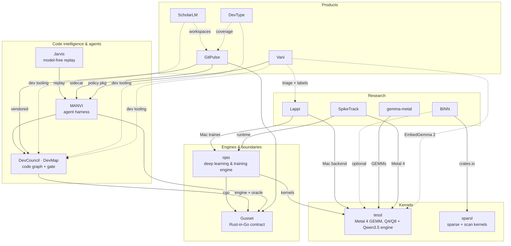
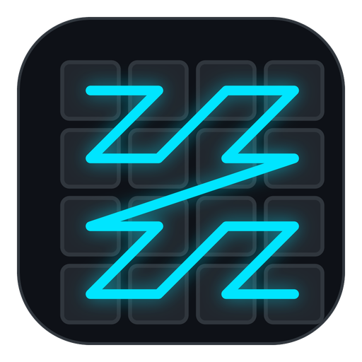
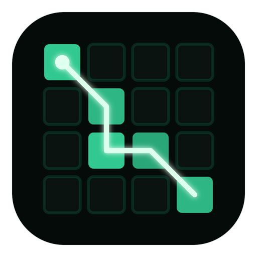
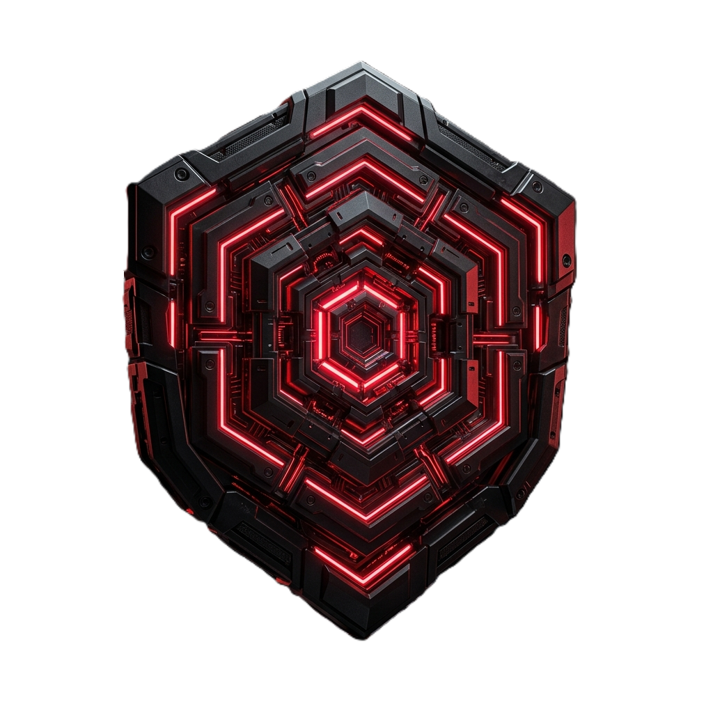
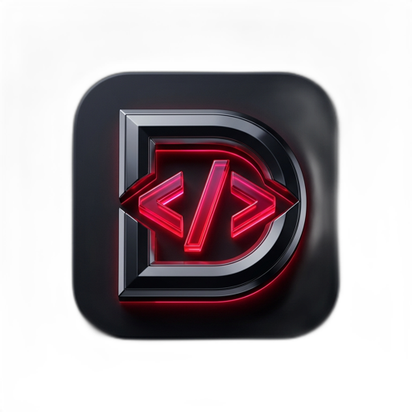
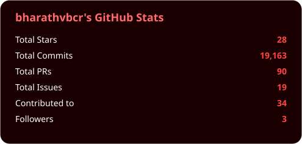
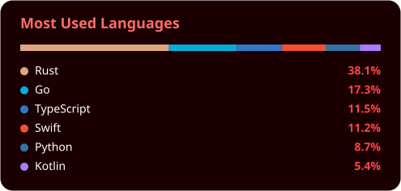
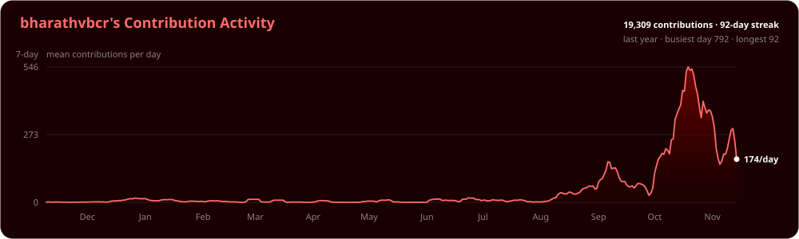

<!-- Hero -->

  
   
   
  
<strong>ML systems engineer · Founder at <a href="https://scholarlm.dev/">ScholarLM</a></strong>

  
I make ML and developer infrastructure fast, and I prove it with numbers: Metal GPU kernels, Rust and Go runtimes, and code-intelligence tools for AI agents, built as modules that every new project reuses.

  
<b>Open to opportunities</b> · <a href="mailto:bharath@vbcr.dev">bharath@vbcr.dev</a> 

   
  &nbsp;&nbsp;
    
  
    
  &nbsp;&nbsp;&nbsp;

---

## At a glance

- **Now:** founder and sole engineer of [ScholarLM](https://scholarlm.dev/), an AI research platform (React 19, Rust, Go and Python) that writes fully-cited, grounded manuscripts (**97.7%** [`85/87`] precision on public LitQA2 without a supplied paper corpus). In parallel I build the Apple-silicon GPU, Go↔Rust contract, and code-intelligence stack below.
- **Strongest results:** an Apple-silicon Metal 4 multimodal runtime (**3.06–4.37× faster** in bf16 than PyTorch MPS while fitting 4K–6K ragged workloads in ≤1,911 MiB where PyTorch OOMs at 33.6 GiB), LoRA activation checkpointing and weight-gradient skipping cutting Metal device peaks by **−78%** and **−44%**, a code-graph indexer **1.6–21× faster** than four other tools on every corpus tested, GitPulse cutting 30k-commit graph refresh to **1.11 ms** (`25.19 → 1.11 ms`) and watcher wakeups from **117.3 → 2.7/s**, and a Go↔Rust call made **8.5× cheaper**.
- **Before:** Associate Researcher at the Adidas Center for Engagement Science (ASU, 2023–2025), and stem-cell research at Texas Tech University Health Sciences Center.
- **Education & papers:** M.S. Biomedical Engineering, Arizona State University (2024) · 2 peer-reviewed papers (2025).
- **Upstream:** Initiated the official Eclipse `iceoryx2` Go bindings ([`eclipse-iceoryx/iceoryx2-go`](https://github.com/eclipse-iceoryx/iceoryx2-go): proposal, repo provisioning, first PR under review); merged patches in [`rust-lang/libc`](https://github.com/rust-lang/libc/pull/5609) (`0.2.191`) and [`objc2`](https://github.com/madsmtm/objc2/pull/870); Apple Silicon MPS `NaN` diagnosis & reproducer in [`decider-ai`](https://github.com/Mapika/decider/issues/21) (`1.8.2`).

---

## Upstream

- **[Eclipse iceoryx2](https://github.com/eclipse-iceoryx/iceoryx2)** — proposed and scaffolded the official Go bindings in [`eclipse-iceoryx/iceoryx2-go`](https://github.com/eclipse-iceoryx/iceoryx2-go) ([#225](https://github.com/eclipse-iceoryx/iceoryx2/issues/225), [#2104](https://github.com/eclipse-iceoryx/iceoryx2/issues/2104)). Provisioned the repository and branch rulesets with the project leads ([.eclipsefdn#28](https://github.com/eclipse-iceoryx/.eclipsefdn/pull/28)) and built the Step 1 `NodeBuilder` → `Node` `cgo` package over the `iceoryx2-ffi` C API with a release-pinned `iceoryx2` submodule (`iox2_*_storage_t` ABI parity), `golangci-lint` v2, and Go 1.26/1.27 Linux/macOS `-race` CI, now open for review as [PR #1](https://github.com/eclipse-iceoryx/iceoryx2-go/pull/1) (first validated on [the fork](https://github.com/bharathvbcr/iceoryx2-go/pull/1)). Committer election follows a review track record; the binding is not published yet.
- **[rust-lang/libc](https://github.com/rust-lang/libc)** — added Apple `F_SETNOSIGPIPE` (`73`) and `F_GETNOSIGPIPE` (`74`) ([#5609](https://github.com/rust-lang/libc/pull/5609)), shipped in `libc 0.2.191`. Upstreamed from completion-pipe `SIGPIPE` suppression in [Gusset](https://github.com/bharathvbcr/gusset).
- **[objc2](https://github.com/madsmtm/objc2)** — marked `MTLTensorDescriptor` consumers `unsafe` in `objc2-metal` ([#870](https://github.com/madsmtm/objc2/pull/870), [#782](https://github.com/madsmtm/objc2/issues/782), found while building Metal 4 tensor ops in [tessl](https://github.com/bharathvbcr/tessl)): Metal segfaults on a nil stride or an oversized tensor instead of returning an error. Also restricted the AppKit examples to macOS ([#871](https://github.com/madsmtm/objc2/pull/871)).
- **[Mapika/decider](https://github.com/Mapika/decider)** (`decider-ai`) — diagnosed `non_blocking=True` host-to-MPS copies of temporary CPU tensors returning `NaN` in `scaled_softmax` and `read_slots` ([#21](https://github.com/Mapika/decider/issues/21)). The reproducer was adopted upstream as a temperature regression test in `decider-ai 1.8.2` (fix by the maintainer). Verified on M5 Pro: `1,697/1,698` choice parity with CPU `float32`.
- **[Electrobun](https://github.com/blackboardsh/electrobun)** — reported Windows packaging resolving `rcedit` from a baked CI path ([#298](https://github.com/blackboardsh/electrobun/issues/298)) and submitted a fix ([#299](https://github.com/blackboardsh/electrobun/pull/299)). That pull request was closed without merging. Also diagnosed the hardcoded Windows icon path ([#235](https://github.com/blackboardsh/electrobun/issues/235)).

---

## Measured

Each figure comes from the project's own benchmark record, with its conditions. Where a figure didn't survive a re-check, it isn't here.

| Project | Result | Conditions |
| --- | --- | --- |
| **[tessl](https://tessl.vbcr.dev/)** | **3.06–4.37× faster bf16 inference than PyTorch MPS**; fits 4K–6K ragged workloads in **≤1,911 MiB** where PyTorch OOMs at 33.6 GiB | Paired against `sentence-transformers 6.1.0` / PyTorch 2.14.1 MPS across 6 EmbedGemma 2 workloads on M5 Pro (host load 5.1–16.7, `2026-10-21`); pure-Rust SentencePiece BPE runs **2.2–3.7×** faster (`3.79M–5.12M tok/s`, `4,671/4,671` exact ID match) than HF `tokenizers 0.23.2`. |
| **[ojas](https://ojas.vbcr.dev/)** | Activation checkpointing cuts peak **18.08 → 3.96 GB (−78%)**; LoRA `dW`-skip cuts peak **11.81 → 6.63 GB (−44%)** and step time **−13.2%** (`6,314 → 5,480 ms`) | MetalBackend on M5 Pro, T = 2,048 (`0.8B-Base` checkpointing, `n = 1`, 28 GiB budget; `2B-Base` `dW`-skip over 5 interleaved reps across 150 adapter sites, 2026-10-22). Metal Flash cross-attention also ran **34.5×** faster (`6.06 vs 209.28 ms`) against `ojas`'s own scalar kernel on SpikeTrack (`2026-11-02`). |
| **[ScholarLM](https://scholarlm.dev/)** | **97.7% (`85/87`) precision on public LitQA2** without a supplied paper corpus | End-to-end literature pipeline on public LitQA2 queries with zero pre-supplied papers, improving over the closed-book baseline (`2026-10-25`). |
| **[DevMap](https://devcouncil.vbcr.dev/)** | **1.6–21× faster cold index** and **2.2–107× faster unchanged-tree refresh** than four other code-graph tools; schema `v29` cut index size **593.4 → 272.6 MB (−54%)** | Indexing speed measured on `v0.2.2` (M5 Pro, fixed commits, lost single-file re-index to CodeGraph, `2026-09-14`); schema `v29` storage measured on the cold GitPulse corpus (`2026-11-02`). |
| **[GitPulse](https://gitpulse.vbcr.dev/)** | **30k-commit graph refresh 25.19 → 1.11 ms**; **24-watch interrupt wakeups 117.3 → 2.7/s**; **hook gate 32.16 → 11.16 ms (−65%)**; **100k-task search p95 97.59 → 44.60 ms** | Revision-token graph refresh (`4.79 → 1.15 ms` at 5k across 21/21 rounds, `2026-11-09`); kernel `kqueue`/wake-pipe loops on macOS (`2026-10-13`); local-socket hook gate (`7` interleaved rounds, `2026-10-13`); interleaved `100k`-task search on M5 Pro (`2026-10-07`). Also cut verification sweep duty `~80% → ~27%`. |
| **[Gusset](https://gusset.vbcr.dev/)** | Go→Rust serial call **90.3 → 10.6 µs (8.5×)** | Spin-then-park, certified before/after on one linux-amd64 VM (`2026-10-08`). A later shared-memory ring (7.46 → 3.73 µs) ran in a different container without a provenance header, so the two are not chained. |

---

## The stack

Each project is a module the next one is built on. Every arrow below is a real dependency in the source: a crate, a `go.mod` require, a vendored engine or a spawned sidecar. Arrows point from a project to what it builds on.

```mermaid
flowchart TB
  subgraph K["Kernels"]
    tessl["tessl<br/>Metal 4 GEMM, Q4/Q8 + Qwen3.5 engine"]
    sparsl["sparsl<br/>sparse + scan kernels"]
  end
  subgraph E["Engines & boundaries"]
    ojas["ojas<br/>deep learning &amp; training engine"]
    gusset["Gusset<br/>Rust-in-Go contract"]
  end
  subgraph A["Code intelligence & agents"]
    devmap["DevCouncil · DevMap<br/>code graph + gate"]
    manvi["MANVI<br/>agent harness"]
    jarvis["Jarvis<br/>model-free replay"]
  end
  subgraph P["Products"]
    gitpulse["GitPulse"]
    scholarlm["ScholarLM"]
    devtype["DevType"]
    vani["Vani"]
  end
  subgraph R["Research"]
    binn["BINN"]
    lappi["Lappi"]
    gemma["gemma-metal"]
    spiketrack["SpikeTrack"]
  end

  ojas -->|kernels| tessl
  ojas -->|cgo| gusset
  lappi -->|Mac backend| tessl
  lappi -->|Mac trainer| ojas
  binn -->|crates.io| sparsl
  binn -.->|optional| tessl
  gemma -->|GEMMs| tessl
  spiketrack -->|Metal 4| tessl
  spiketrack -->|runtime| ojas
  devmap -->|engine + oracle| gusset
  manvi --> devmap
  manvi --> gusset
  jarvis -->|replay| manvi
  gitpulse -->|vendored| devmap
  gitpulse -->|sidecar| manvi
  gitpulse --> gusset
  scholarlm -.->|dev tooling| devmap
  scholarlm -.->|workspaces| gitpulse
  devtype -.->|dev tooling| devmap
  devtype -.->|coverage| gitpulse
  vani -->|policy pkg| manvi
  vani -.->|EmbedGemma 2| tessl
  vani -.->|triage + labels| lappi
  vani -.->|dev tooling| devmap
```

`sparsl` was lifted out of BINN's numeric core and published on its own. GitPulse and DevCouncil power development workflows across ScholarLM, DevType, Vani, and the rest of the workspace; GitPulse also vendors MarkDev's renderer crates, and DevPrism embeds MANVI as its tool gate. Explore the interactive stack on **[bharath.vbcr.dev](https://bharath.vbcr.dev/#ecosystem)**.

---

## Core projects

<table>
<tr><th align="center" width="72"></th><th align="left">Project</th><th align="left">Builds on · Used by</th></tr>

<tr><td colspan="3"><b>Kernels</b></td></tr>
<tr>
<td align="center"></td>
<td><b><a href="https://github.com/bharathvbcr/tessl">tessl</a></b> · <a href="https://tessl.vbcr.dev/">tessl.vbcr.dev</a> Makes matrix math and LLM inference fast on Apple GPUs (v0.2.0 on crates.io). A Metal 4 GEMM and tensor runtime in Rust using MPP TensorOps <code>matmul2d</code>, cooperative register accumulators, fused epilogues, MLX-affine Q8/Q4 dequantization, and Metal 4 e-means kernels. Runs EmbedGemma 2 3.06–4.37× faster in bf16 than <code>sentence-transformers</code> on PyTorch MPS (fitting 4K–6K ragged inputs in ≤1,911 MiB where PyTorch OOMs at 33.6 GiB) and tokenizes at 3.79M–5.12M tok/s (2.2–3.7× HF <code>tokenizers</code>); retired its standalone training step to <code>ojas</code> (C ABI 14) while supplying <code>ojas</code>'s Metal backward kernels.</td>
<td>Used by ojas, Lappi, gemma-metal, BINN, SpikeTrack</td>
</tr>
<tr>
<td align="center"></td>
<td><b><a href="https://github.com/bharathvbcr/sparsl">sparsl</a></b> ·  Fast, reproducible kernels for spiking-network simulation: resident CSR SpMV, fused LIF membrane updates, a chunked prefix scan, and <code>MTLSharedEvent</code> zero-copy handoff with <code>tessl</code> (v0.3.0). A <code>Device</code> exists only for a backend that can actually execute, so results reproduce bit for bit and never misreport where they ran.</td>
<td>Lifted out of BINN · used by BINN</td>
</tr>

<tr><td colspan="3"><b>Engines &amp; boundaries</b></td></tr>
<tr>
<td align="center"></td>
<td><b><a href="https://github.com/bharathvbcr/ojas">ojas</a></b> · <a href="https://ojas.vbcr.dev/">ojas.vbcr.dev</a> Trains and runs neural networks on Metal, CPU, and WebGPU inside Go services with no Python runtime. Owns the Metal/CPU reverse-mode training step: LoRA <code>dW</code>-skip cut Qwen3.5-2B device peak 11.81 → 6.63 GB (−44%) and step time 13.2%, activation checkpointing cut 0.8B peak 18.08 → 3.96 GB (−78%), Flash cross-attention ran 34.5× faster than its own scalar kernel on SpikeTrack, and 118 C-ABI checks pass alongside in-process Go tests.</td>
<td>Builds on tessl, Gusset · used by Lappi, SpikeTrack</td>
</tr>
<tr>
<td align="center"></td>
<td><b><a href="https://github.com/bharathvbcr/gusset">Gusset</a></b> · <a href="https://gusset.vbcr.dev/">gusset.vbcr.dev</a> Lets a Go service call a Rust engine safely and cheaply (v0.0.3, MIT / Apache-2.0): panic firewall, bounded uncollected completions (1,024 default), bounded 30 s <code>Close</code> with worker process-group teardown, deadlines enforced inside Rust, poisoned handles, per-field ABI checks, and ARM64 wait-ring formal concurrency scaffolding.</td>
<td>Used by DevCouncil, MANVI, ojas, GitPulse</td>
</tr>

<tr><td colspan="3"><b>Code intelligence &amp; agents</b></td></tr>
<tr>
<td align="center"></td>
<td><b><a href="https://github.com/bharathvbcr/DevCouncil">DevCouncil · DevMap</a></b> · <a href="https://devcouncil.vbcr.dev/">devcouncil.vbcr.dev</a> Gives AI coding agents a fast, accurate map and verification gate (v0.2.3). DevMap builds stacked zero-copy SQLite code graphs (schema <code>v29</code> shrank cold GitPulse index size 593.4 → 272.6 MB), serves 11 MCP tools (<code>devmap ask</code>, blast radius with owners, commit suspects), and links Lean 4 TCB / anti-reward-hacking checks; write-policy matching runs in Go (Gusset handles <code>gusset-check</code> and the <code>dc-glob</code> oracle), with 111/117 Swift and 74/79 Python resolution fixtures passing.</td>
<td>Builds on Gusset · used by MANVI, GitPulse, ScholarLM, DevType, Vani (dev tooling)</td>
</tr>
<tr>
<td align="center"></td>
<td><b><a href="https://github.com/bharathvbcr/Manvi">MANVI</a></b> · <a href="https://manvi.vbcr.dev/">manvi.vbcr.dev</a> Runs AI coding agents under explicit policy in pure Go (1.27.4) and Rust across a process boundary: 51 native tools (25 dynamically activated core + 26 extended), SQLite lease exclusion, Antigravity MCP support, and a six-step policy ladder whose outcomes stay distinct (1,031 cross-language parity cases, 86.9% Go statement coverage across 21 zero-tolerance linters).</td>
<td>Builds on DevCouncil, Gusset · used by GitPulse, Jarvis, DevPrism</td>
</tr>
<tr>
<td align="center"></td>
<td><b><a href="https://github.com/bharathvbcr/Jarvis">Jarvis</a></b> · <a href="https://jarvis.vbcr.dev/">jarvis.vbcr.dev</a> Desktop capabilities discovered once with Gemini, frozen into typed artifacts, then replayed through MANVI with no model decisions: 35/40 macOS replays and 40/40 saved-state checks, not yet a clean stability pass. Human approval gates every account change.</td>
<td>Builds on MANVI</td>
</tr>

<tr><td colspan="3"><b>Products</b></td></tr>
<tr>
<td align="center"></td>
<td><b><a href="https://github.com/bharathvbcr/GitPulse">GitPulse</a></b> · <a href="https://gitpulse.vbcr.dev/">gitpulse.vbcr.dev</a>  Single-process Rust / Tauri 2 / Svelte 5 control plane (zero telemetry) for Git review, worktree collision detection, task orchestration, and supervised AI agent sessions: split-pane canvas terminal multiplexer, native <code>wry</code> browser tabs with element picker and port radar, 22 MCP tools (11 DevMap code-graph + 11 worktree/task tools), per-user class-based git spawn budgeting, 6-phase git option-injection hardening, 322 contract-checked IPC handlers (2,080 struct fields), and 95.07% Vitest frontend coverage across 14,072 tests.</td>
<td>Builds on DevCouncil, MANVI, Gusset · drives workspaces across ScholarLM &amp; DevType</td>
</tr>
<tr>
<td align="center"></td>
<td><b><a href="https://scholarlm.dev/">ScholarLM</a></b> · <a href="https://scholarlm.vbcr.dev/">showcase &amp; architecture</a> AI research platform searching 20 scholarly sources across ~250 Go routes and writing fully-cited, grounded manuscripts (plan → write → verify → review, <b>97.7%</b> [85/87] precision on public LitQA2 with no supplied corpus): React 19 PWA, Rust edge (with MCP OAuth 2.1 / PKCE S256), Go orchestration core, Python ML worker, and a 25-tool MCP server whose agent layer is open as <a href="https://github.com/bharathvbcr/WisDev">WisDev</a>.</td>
<td>DevMap &amp; GitPulse power its coding-agent workflows</td>
</tr>
<tr>
<td align="center"></td>
<td><b><a href="https://github.com/bharathvbcr/DevType">DevType</a></b> · <a href="https://devtype.vbcr.dev/">devtype.vbcr.dev</a>  Native macOS text expander and on-device writing assistant in Swift/AppKit (v1.2.0 + companion <code>devtype-cli</code>, 5,085 automated tests executed). Typed triggers expand in ordinary text fields; proofread, rewrite, translate and code actions run on Apple Foundation Models offline; imports TextExpander/Espanso and protects secrets behind Touch ID.</td>
<td>DevCouncil verifies its changes; its coverage export feeds GitPulse (development tooling)</td>
</tr>
<tr>
<td align="center"></td>
<td><b><a href="https://github.com/bharathvbcr/Vani">Vani</a></b> · <a href="https://bharath.vbcr.dev/vani">architecture &amp; apply suite</a> Listings-first career engine and local-first apply suite in Go (<code>vanid</code>), Swift (macOS Vani Apply), and TypeScript (Chrome/Safari WebExtensions). Ingests roles across 30 ATS platforms, drops stale/duplicate listings at zero token cost, triages open roles across four slots (role fit, sponsorship, work mode, seniority), exports <code>BLAKE2b</code> MinHash held-out fingerprints so Lappi's contamination gate refuses train/eval overlap, and generates grounded <code>rkb</code>-verified resumes behind a fail-closed claim eligibility gate.</td>
<td>Builds on MANVI, tessl (EmbedGemma 2), Lappi, DevCouncil tooling</td>
</tr>

<tr><td colspan="3"><b>Research</b></td></tr>
<tr>
<td align="center">🧠</td>
<td><b><a href="https://github.com/bharathvbcr/Brain-Inspired_Neural_Network">BINN</a></b> · <a href="https://binn.vbcr.dev/">binn.vbcr.dev</a> From-scratch Rust instrument that falsified backprop-free local learning under pre-registered kill-gates, then earned a positive on Spiking Heidelberg Digits (0.8320, 12/12 seeds ≥ 0.80) proving temporal spike order drives the causal-attention read-out; bit-exact NEON attention (1.85× fewer cycles) and Accelerate BLAS (2.23× fewer cycles) accelerate 2-epoch SHD cells over <code>sparsl 0.3</code> resident ticks.</td>
<td>Builds on sparsl, tessl</td>
</tr>
<tr>
<td align="center"></td>
<td><b><a href="https://github.com/bharathvbcr/SpikeTrack">SpikeTrack</a></b> · <a href="https://bharath.vbcr.dev/spiketrack">architecture &amp; parity</a>  Pure-Rust port of Meta's SAM 3.1 multiplex video tracker on Apple Silicon (zero Python at runtime, Pillow-exact JPEG decoder, 14 linked system frameworks): mixes an fp16 Core ML default trunk (0.569–0.600× fp32 trunk frame time on VISEM) with merge encodes, segmentation head, and Metal 4 Flash cross-attention on <code>ojas</code> / <code>tessl</code> (0.5695 held-out HOTA vs 0.5700 fp32 across 1,500 frames).</td>
<td>Builds on ojas, tessl</td>
</tr>
<tr>
<td align="center"></td>
<td><b><a href="https://github.com/bharathvbcr/Lappi-decision">Lappi</a></b> · <a href="https://lappi.vbcr.dev/">lappi.vbcr.dev</a>  Calibrated typed-decision model (v0.1 preview 0.857 choice top-1, not promoted after OOD abstention 149/180 missed its 90% bar): schema in, typed slots out (choice, score, span, abstain) where <code>not_run</code> never counts as a pass. Now serves calibrated job-modeling heads (<code>role_fit</code>, <code>work_mode</code>, <code>seniority</code>, <code>sponsorship</code>) on <code>ojas</code> / <code>tessl</code> behind a MinHash contamination gate and −47% scan peak containment (20.6–22.6 → 10.9–12.0 GiB).</td>
<td>Builds on tessl, ojas</td>
</tr>
<tr>
<td align="center"></td>
<td><b><a href="https://github.com/bharathvbcr/nanolab">nanolab</a></b> · <a href="https://attention.vbcr.dev/">attention.vbcr.dev</a> Instrumented small-LM training lab (378/378 checks passing): attention, Mamba-2, Gated DeltaNet and minGRU behind CLI flags, chunk-parallel scan kernels, and seed-paired intervals — withdrawing unpaired GDN/Mamba-2 speedups directly in the committed TMLR/preprint manuscript.</td>
<td>Research companion to the kernels</td>
</tr>
<tr>
<td align="center"></td>
<td><b><a href="https://github.com/bharathvbcr/gemma-metal">gemma-metal</a></b>  Gemma inference runtime for Apple silicon with split sliding/global KV ring caches. Takes its general and INT4 GEMM kernels from <code>tessl</code>, and remains below its own decode-speed gate (6.83 vs 15 tok/s on 31B Q4; 23.9 vs 48 on E4B).</td>
<td>Builds on tessl</td>
</tr>
</table>

---

## Where the stack goes next

These are directions, each grounded in what the repositories themselves record as open:

- **Train and serve Lappi on my own stack.** Lappi's Mac trainer already runs on `ojas` and its backend serves on `tessl`'s Qwen3.5 kernels, while the main `2B` campaign runs on PyTorch. Next: OOD abstention, serving the code-defect family, and promoting job-modeling runs past pre-registered validation floors.
- **A device-aware engine for Go services.** `ojas` reaches Go through Gusset, and its resource plan reads cores, caches, unified memory, and cgroup limits — but there is no automatic device router yet. Routing work between CPU and Metal from that plan is next.
- **Spiking read-outs on the current kernels.** BINN's `tessl` interop is pinned to `0.1.4`, while `tessl` has moved to `0.2.0` (`C ABI 14`). Bringing the attention read-out that earned the SHD result onto the current kernels comes next.
- **One shared code-graph and policy substrate.** DevMap and GitPulse already power engineering workflows across ScholarLM, DevType, and Vani, and MANVI under GitPulse, Jarvis, Vani, and DevPrism, so schema (`v29`/`v99`) and formal-verification upgrades propagate across every repository at once.

---

## Research & publications

| Paper | Journal | Year |
| --- | --- | --- |
| [Investigation on the heating effects of intra-tumoral injectable magnetic hydrogels (IT-MG) for cancer hyperthermia](https://iopscience.iop.org/article/10.1088/2057-1976/adaec6/meta) | _Biomedical Physics & Engineering Express_ | 2025 |
| [The Therapeutic Scope of Orofacial Mesenchymal Stem Cells](https://www.mdpi.com/2306-5354/12/9/970) | _Bioengineering_ | 2025 |

Biomedical computing: **[GenoThermal_Targeting](https://github.com/bharathvbcr/GenoThermal_Targeting)**, a patient-specific magnetic-nanoparticle therapy pipeline from genomic discovery through physics simulation. Research briefs are at **[research.vbcr.dev](https://research.vbcr.dev/)**.

---

## Also built

Side projects: finished or maintained, but outside the main stack

 

- **[Graft](https://github.com/bharathvbcr/Graft)**: sealed Mac-to-Android continuity workspace (clipboard images/text, zipped folders, notifications, remote shell and audio) over mutual TLS 1.3 and Tailscale/USB, checked by a symbolic Dolev-Yao verifier, Kani proofs, and Lean 4 protocol specs.
- **[Chronicle](https://github.com/bharathvbcr/Chronicle)**: local-first second brain across Mac and Android (pinned LAN TLS, E2EE locked-vault parking, local Ollama RAG).
- **[MarkDev](https://github.com/bharathvbcr/MarkDev)**: native macOS Markdown editor (`v0.0.3`) on a Swift + 4-crate Rust core; its renderer crates are vendored into GitPulse.
- **[DevPrism](https://github.com/bharathvbcr/DevPrism)**: local-first LaTeX and research workspace, forked from claude-prism, with MANVI as its tool gate.
- **[M5Blade](https://github.com/bharathvbcr/M5Blade)**: Apple-silicon fan controller that writes to the SMC behind a race-free control gate.
- **[Strait](https://strait.vbcr.dev/)**: macOS bulk transfer (`F_NOCACHE` I/O, pure-Swift BLAKE3 hash-on-write, and resumable staging).
- **[Curio](https://github.com/bharathvbcr/Curio)**, **[ChronosFlow](https://github.com/bharathvbcr/ChronosFlow)**, **[Meridian](https://github.com/bharathvbcr/Meridian)**, **[TrailBlazer](https://github.com/bharathvbcr/TrailBlazer)**: on-device AI and native mobile apps.
- **[SalEdge](https://github.com/bharathvbcr/SalEdge)**: multi-firm ERP for battery retailers, with GST e-invoicing and a local AI layer.
- **[AcademiaTrack](https://github.com/bharathvbcr/AcademiaTrack)**, **[Void](https://github.com/bharathvbcr/Void)**, **[Whimsical-Love](https://github.com/bharathvbcr/Whimsical-Love)**: web apps and experiences.

Everything has a page at **[apps.vbcr.dev](https://apps.vbcr.dev/)**.

---

### Stack

**Systems** &nbsp;     

**ML** &nbsp;   

**Product** &nbsp;     

---

### GitHub activity

  &nbsp;
  

  

---

  

